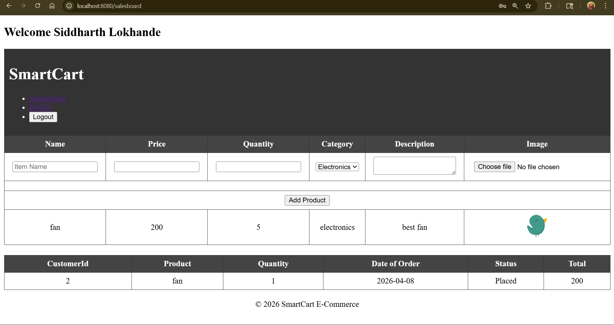

# 🌐 Project Name: [SmartCart]

A full-stack web application built using the **Spring Ecosystem**, featuring server-side rendering with **Thymeleaf** and a robust **MySQL** database.

---

## 🚀 Features
* **User Authentication:** Secure login and registration flows.
* **Dynamic Content:** Server-side rendering using Thymeleaf fragments.
* **CRUD Operations:** Comprehensive data management for [Entity Name].
* **Responsive UI:** Styled with custom CSS and HTML5.
* **Database Management:** Object-Relational Mapping (ORM) via Spring Data JPA.

## 📸 Screenshots

### 🖥️ Dashboard
> *Brief description of what the user sees here.*
> 

### 📝 Dashboard-2
> *Showcasing Spring MVC form binding and validation.*
> 

---

## 🛠️ Tech Stack

| Layer | Technology |
| :--- | :--- |
| **Language** | Java 17+ |
| **Framework** | Spring Boot 3.x (MVC, Data JPA) |
| **Template Engine** | Thymeleaf |
| **Frontend** | HTML5, CSS3 |
| **Database** | MySQL |
| **Build Tool** | Maven / Gradle |

---

## ⚙️ Configuration & Setup

### 1. Database Setup
Create a MySQL database and update your `src/main/resources/application.properties`:

```properties
spring.datasource.url=jdbc:mysql://localhost:3306/your_db_name
spring.datasource.username=your_db_user
spring.datasource.password=your_db_password

# Hibernate Settings
spring.jpa.hibernate.ddl-auto=update
spring.jpa.show-sql=true
